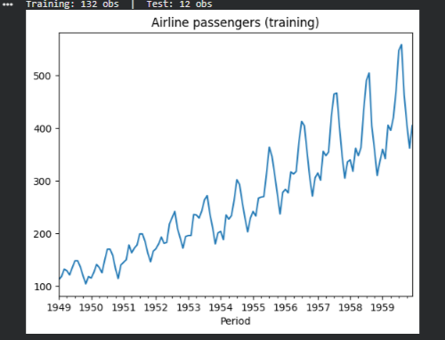
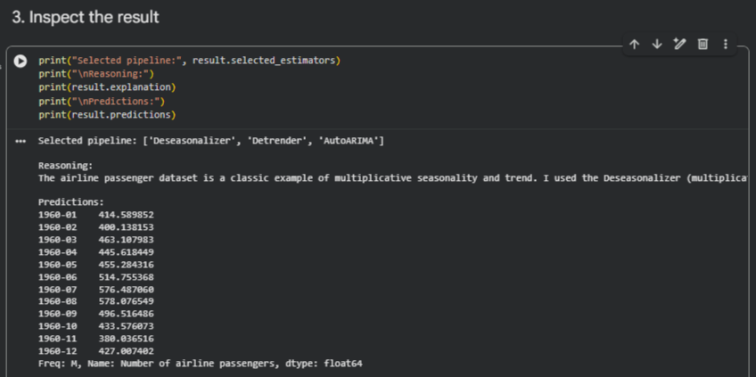
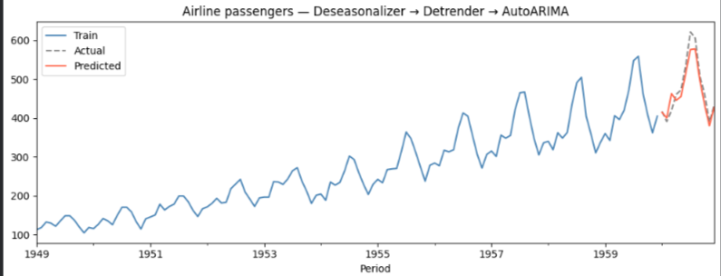
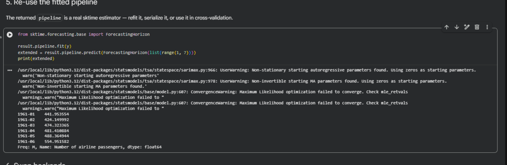

# sktime-agentic-forecaster

An LLM-powered forecasting agent that takes a natural language description of a forecasting task, automatically selects the right `sktime` estimators, builds a pipeline, fits it on your data, and returns predictions.

Ref: [sktime/sktime#9721](https://github.com/sktime/sktime/issues/9721)

---

## Results

### Training data


### LLM-selected pipeline & predictions


### Forecast vs actuals


### Re-using the fitted pipeline


---

## What it does

You give it a text prompt and a dataset. It gives you a forecast.

```python
from sktime_agent import AgenticForecaster

forecaster = AgenticForecaster(llm_backend="anthropic")  # or "openai", "gemini", langchain LLM

result = forecaster.forecast(
    prompt="Forecast the next 12 months of airline passengers. Use deseasonalisation and detrending.",
    data=y_train,   # pandas Series or single-column DataFrame
    horizon=12,
)

print(result.predictions)          # pandas Series of forecasted values
print(result.pipeline)             # the sktime pipeline it built
print(result.explanation)          # why it chose this approach
print(result.selected_estimators)  # e.g. ["Deseasonalizer", "Detrender", "AutoARIMA"]
```

---

## Installation

```bash
git clone https://github.com/mohammedfirdouss/sktime-agentic-forecaster.git
cd sktime-agentic-forecaster
pip install -e ".[anthropic]"   # or [openai] / [gemini] / [langchain] / [all]
```

### Backend extras

| Extra | Installs | Use when |
|---|---|---|
| `[anthropic]` | `anthropic` SDK | Using Claude (recommended) |
| `[openai]` | `openai` SDK | Using GPT-4o / GPT-4 |
| `[gemini]` | `google-generativeai` | Using Gemini |
| `[langchain]` | `langchain`, `langchain-core` | Passing any LangChain LLM |
| `[all]` | All of the above | |
| `[dev]` | `pytest`, `jupyter`, `matplotlib` | Development / running the demo |

---

## API keys

Set one environment variable depending on your chosen backend:

```bash
# Anthropic (Claude)
export ANTHROPIC_API_KEY="sk-ant-..."

# OpenAI
export OPENAI_API_KEY="sk-..."

# Gemini
export GOOGLE_API_KEY="..."
```

Or add it to a `.env` file in the project root (already in `.gitignore`):

```
ANTHROPIC_API_KEY=sk-ant-...
```

---

## Quick start

```python
import os
from sktime.datasets import load_airline
from sktime_agent import AgenticForecaster

os.environ["ANTHROPIC_API_KEY"] = "sk-ant-..."

y = load_airline()

result = AgenticForecaster(llm_backend="anthropic", verbose=True).forecast(
    prompt="Monthly airline passengers with strong trend and seasonality. Forecast 12 months.",
    data=y[:-12],
    horizon=12,
)

print(result.predictions)
print(result.explanation)
```

---

## Demo notebook

```bash
pip install -e ".[dev]"
jupyter notebook examples/demo1.ipynb
```

The notebook walks through loading data, running the agent, plotting predictions vs actuals, and reusing the fitted pipeline.

---

## How it works

1. **Parse the prompt** — extract the task, preferences, and constraints.
2. **Build context** — inspect the dataset (length, frequency, missing values) to inform model selection.
3. **LLM selects** — the LLM picks estimators from a curated registry of sktime forecasters and transformers, configured for the data.
4. **Build pipeline** — the JSON spec is turned into a real `sktime` `TransformedTargetForecaster`.
5. **Fit and predict** — the pipeline is fitted on your data and returns predictions for the requested horizon.
6. **Structured output** — you get predictions, the live pipeline object, and the LLM's reasoning.

---

## Available estimators

### Forecasters
`NaiveForecaster`, `ExponentialSmoothing`, `AutoARIMA`, `ARIMA`, `ThetaForecaster`, `AutoETS`, `TBATS`

### Transformers (prepended to pipeline)
`Deseasonalizer`, `Detrender`, `BoxCoxTransformer`, `LogTransformer`, `Imputer`

---

## Using a LangChain LLM

Pass any LangChain-compatible LLM directly:

```python
from langchain_openai import ChatOpenAI
from sktime_agent import AgenticForecaster

result = AgenticForecaster(llm_backend=ChatOpenAI(model="gpt-4o")).forecast(
    prompt="...", data=y_train, horizon=12
)
```

---

## Running tests

No API key needed — all LLM calls are mocked.

```bash
pip install -e ".[dev]"
pytest tests/ -v
```

---

## Design decisions

Based on guidance from [sktime#9721](https://github.com/sktime/sktime/issues/9721):

- **Text-only as primary argument.** The user describes what they want in plain English.
- **LLM-agnostic.** OpenAI, Anthropic, Gemini, or any LangChain LLM — no lock-in.
- **sktime-native output.** The returned pipeline is a real sktime object you can inspect, refit, or serialize.
- **Forecasting first.** Initial prototype focuses on univariate forecasting with optional transformation pipelines.

---

## Requirements

- Python >= 3.9
- sktime >= 0.24.0
- One LLM backend (see Installation)

---

## License

BSD-3-Clause
